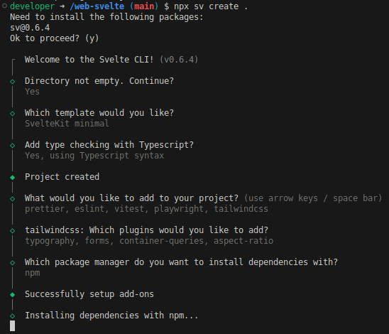

# Svelte 5 Website Template

A starting point for static websites, SPAs, and PWAs using Svelte 5 with adapter static.

## Features

1. A Node based dev-container for a consistent development environment.
   1. Based on Microsoft's [devcontainer][1] spec.
   1. Uses the host's timezone (`$TZ`) and Github CLI token (`$GITHUB_TOKEN`).
   1. If `$GITHUB_TOKEN` is set, it will clone the user's `dotfiles` repository and run its `install.sh` after creating the container. See [jifalops/dotfiles][2] for an example.
   1. Local shell history is persisted when rebuilding the container.
1. Sets up a backend `API_URL` that changes between local development and production, and can easily be removed if building a static site.
1. Integrated terminals when opened with VS Code:
   1. Runs unit tests and starts the dev server (`npm run dev`).
   1. Runs integration tests and starts the preview server (`npm run preview`).
   1. Spoofs a locally running backend by proxing `dummyjson.com`.
1. GitHub Actions for:
   1. Running tests on PRs and changes to `main`.
   1. Deploying `main` to GitHub Pages.
   1. Previewing PRs in a Github Pages subdirectory.
1. Obfuscated builds, locally and deployed (`npm run build && npm run obfuscate`).
1. Tailwind preconfigured with a simple light and dark theme.
1. Modern Ports and Adapters (hexagonal) architecture with a feature-based directory structure.
1. Core services baked in:
   1. Telemetry with Google Analytics 4, including a mock implementation.
   1. Advertising with Google AdSense, including a mock implementation.
   1. Logging.
   1. Base class for app errors.
1. Iconify icons integrated via unplugin-icons. Builds only the icons used.
1. Svelte 5 out of the box.

   

## Getting Started

1. Clone this repository / use this template.
2. In your repository settings for GitHub Pages, choose `Deploy from a branch`.
   
   > You may have to create the `gh-pages` branch first or let the `.github/workflows/deploy.yml` workflow do it for you.
3. Install the [Dev Containers][3] extension for VS Code to develop within the configured environment.

[1]: https://github.com/devcontainers/images/tree/main/src/typescript-node
[2]: https://github.com/jifalops/dotfiles
[3]: https://marketplace.visualstudio.com/items?itemName=ms-vscode-remote.remote-containers
